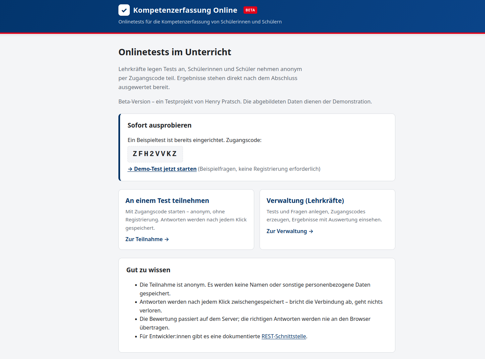
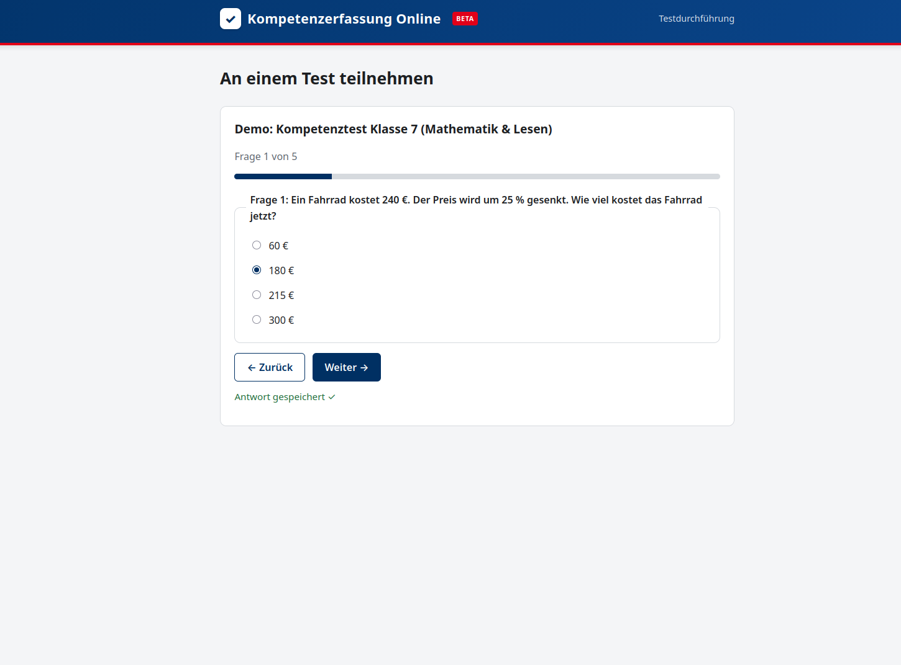
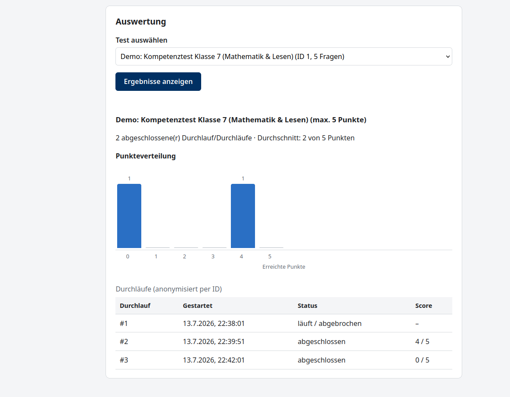

<div align="center">

# ✓ Kompetenzerfassung Online

**Onlinetests für die Kompetenzerfassung von Schülerinnen und Schülern**

[](https://kompetenzerfassung-online.onrender.com)


**Live-Demo:** [https://kompetenzerfassung-online.onrender.com](https://kompetenzerfassung-online.onrender.com)

</div>

---

Kleines webbasiertes Tool, um Onlinetests mit Schulklassen durchzuführen.
Lehrkräfte legen Tests mit Multiple-Choice-Fragen an, Schüler:innen nehmen
anonym über einen Zugangscode teil, die Auswertung gibt es direkt danach.

Beta-Version, ein Testprojekt von Henry Pratsch.

Technik: Python/FastAPI, SQLModel, SQLite, statisches Frontend ohne Build-Step.

## Screenshots

| Startseite | Testdurchführung |
|:---:|:---:|
|  |  |

<div align="center">

**Auswertung mit Punkteverteilung**



</div>

## API

Die Schnittstelle ist über die von FastAPI generierte Doku unter `/docs`
bzw. `/redoc` einsehbar; `openapi.yaml` liegt als Snapshot im Repo und wird
nach API-Änderungen mit `python scripts/export_openapi.py` aktualisiert.

Kurzüberblick:

| Methode & Pfad | Zweck |
|---|---|
| `GET /api/tests` | Tests auflisten |
| `POST /api/tests` | Test anlegen (Zugangscode wird generiert) |
| `GET /api/tests/{id}` | Test mit Fragen abrufen |
| `POST /api/tests/{id}/items` | Frage hinzufügen |
| `GET /api/tests/{id}/results` | Ergebnisse und Aggregation |
| `POST /api/attempts` | Durchlauf per Zugangscode starten |
| `GET /api/attempts/{id}` | Durchlauf mit bisherigen Antworten (Wiedereinstieg) |
| `PATCH /api/attempts/{id}/answers` | Antwort zwischenspeichern |
| `POST /api/attempts/{id}/submit` | Durchlauf abschließen |
| `GET /api/health` | Health-Check |

## Tests

```bash
pytest
```

Die Tests laufen gegen eine In-Memory-Datenbank und decken neben den
Happy-Paths auch die wichtigsten Fehlerfälle ab (ungültiger Code, doppelter
Abschluss, Antworten auf fremde Fragen usw.).

## Deployment

Die App läuft als Live-Demo auf Render.com:
https://kompetenzerfassung-online.onrender.com – jeder Push auf `master`
löst automatisch ein neues Deployment aus.

`render.yaml` enthält die zugehörige Blueprint-Konfiguration (Free Tier
reicht für Demos, hat aber keine persistente Disk – die Datenbank wird dort
bei jedem Deploy geleert). Details und die Fly.io-Alternative stehen im
[Betriebskonzept](docs/betriebskonzept.md); das
[Sicherheitskonzept](docs/sicherheitskonzept.md) beschreibt Datensparsamkeit,
Zugangscodes und die bekannten Einschränkungen der Beta.

## Troubleshooting

**`uvicorn: command not found`** – venv nicht aktiviert oder Abhängigkeiten
fehlen. `source .venv/bin/activate`, dann `pip install -r requirements.txt`.

**`RuntimeError: Directory 'public' does not exist`** beim Start – die App
wurde nicht aus dem Projektverzeichnis gestartet.

**404 „Ungültiger Zugangscode“** – Tippfehler oder der Test existiert nicht
mehr. Groß-/Kleinschreibung und Leerzeichen sind egal, die werden
normalisiert. Auf Render Free Tier: siehe Hinweis oben zur geleerten DB.

**409 „Durchlauf ist bereits abgeschlossen“** – gewollt, abgeschlossene
Durchläufe sind unveränderlich. Einfach einen neuen Durchlauf starten.

**422 Unprocessable Entity** – Validierungsfehler; das `detail`-Feld der
Antwort benennt das Problem.

**Datenbank zurücksetzen** – App stoppen, `onlinetest.db` löschen, App
starten.
